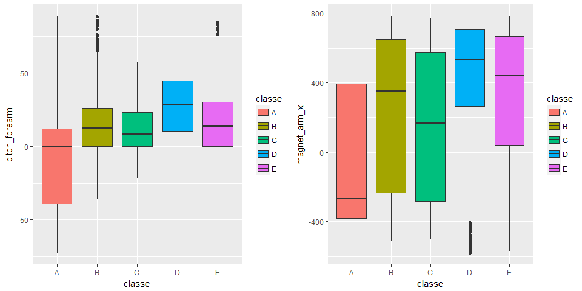
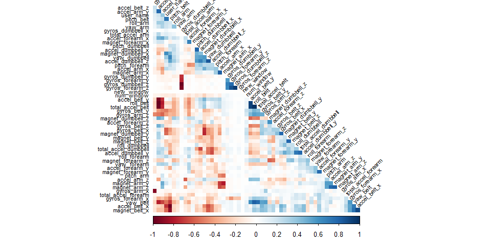
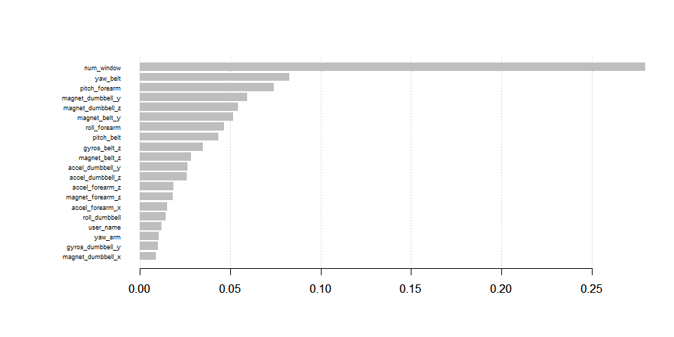

## Outline

The aim of this project is to train a predictive model allowing to predict what exercise was performed using a data set provide by HAR [http://groupware.les.inf.puc-rio.br/har] and using 159 features.


We'll proceed as follows

- Download the data
- Do some preprocessing
- Explore the data,focusing on the parameters we are interested in 
- Model selection, where we try different models to help us answer our questions
- Model examination, to see  which model is the best one 
- A Conclusion where we answer the questions based on the data
- Final Prediction on the test set using our best model 

## 1-Data Dowloading & Reading

```r
setwd("C:/Users/mlemi/Desktop/COURSERA/Data_science_sp/pratical_machine_learning")

training_url <- "https://d396qusza40orc.cloudfront.net/predmachlearn/pml-training.csv"
test_url     <- "https://d396qusza40orc.cloudfront.net/predmachlearn/pml-testing.csv"

download.file(training_url,"pml-training.csv")
download.file(test_url,"pml-testing.csv")
```


```r
training_set <- read.csv("pml-training.csv")
testing_set <- read.csv("pml-testing.csv")
```

## 2-Exploratory data analyses 

Let's have a look at the shape and some statistics of the data sets

```r
## shape,dimensions
dim(training_set)
```

```
## [1] 19622   160
```

```r
dim(testing_set)
```

```
## [1]  20 160
```

```r
##  head
#head(training_set)
#head(testing_set)


## summary statistics useless for the moment
#summary(training_set)
#summary(testing_set)
```

Let's check for missing values and exclude them if there are not so much


```r
head(apply(is.na(training_set),2,sum)) #  allow us to see how much missing values per variable we have 
```

```
##                    X            user_name raw_timestamp_part_1 raw_timestamp_part_2       cvtd_timestamp 
##                    0                    0                    0                    0                    0 
##           new_window 
##                    0
```

```r
# removing missing values, 20%
maxNAPerc = 20
maxNACount <- nrow(training_set) / 100 * maxNAPerc
removeColumns <- which(colSums(is.na(training_set) | training_set=="") > maxNACount)
training.cleaned01 <- training_set[,-removeColumns]
testing.cleaned01 <- testing_set[,-removeColumns]
```

Let's remove all time related data, since we won't use those


```r
removeColumns <- grep("timestamp", names(training.cleaned01))
training.cleaned02 <- training.cleaned01[,-c(1, removeColumns )]
testing.cleaned02 <- testing.cleaned01[,-c(1, removeColumns )]
```

After that we convert all factors to integers

```r
classeLevels <- levels(training.cleaned02$classe)
training.cleaned03 <- data.frame(data.matrix(training.cleaned02))
training.cleaned03$classe <- factor(training.cleaned03$classe, labels=classeLevels)
testing.cleaned03 <- data.frame(data.matrix(testing.cleaned02))
```

Finally set the data set to be explored


```r
training.cleaned <- training.cleaned03
testing.cleaned <- testing.cleaned03
```


## 3-Cross validation 

Now we're going to do cross validation by spliting the train set into a sub train set (75% of the training) and a sub test set (25% of the training) , this will allow us to check the performance of our model on the sub test before predicting on the final test.  


```r
set.seed(19791108)
library(caret)

classeIndex <- which(names(training.cleaned) == "classe")

partition <- createDataPartition(y=training.cleaned$classe, p=0.75, list=FALSE)
training.subSetTrain <- training.cleaned[partition, ]
training.subSetTest <- training.cleaned[-partition, ]
```

Let's check if there are some fields that high correlations with our target variable (class)


```r
correlations <- cor(training.subSetTrain[, -classeIndex], as.numeric(training.subSetTrain$classe))
bestCorrelations <- subset(as.data.frame(as.table(correlations)), abs(Freq)>0.3)
bestCorrelations
```

```
##             Var1 Var2      Freq
## 27  magnet_arm_x    A 0.3027579
## 44 pitch_forearm    A 0.3471068
```

We can see that even the best correlations with class are hardly above 0.3
Let's check visually if there is indeed hard to use these 2 as possible simple linear predictors.


```r
library(Rmisc)
library(ggplot2)

p1 <- ggplot(training.subSetTrain, aes(classe,pitch_forearm)) + 
  geom_boxplot(aes(fill=classe))

p2 <- ggplot(training.subSetTrain, aes(classe, magnet_arm_x)) + 
  geom_boxplot(aes(fill=classe))

multiplot(p1,p2,cols=2)
```

<!-- -->

Clearly there is no hard separation of classes possible using only these 'highly' correlated features.

## 4-Model selection 

Let's identify variables with high correlations among each other in our set, so we can possibly exclude them from the training set using PCA for instance . 

We will check afterwards if these modifications to the data set make the model more accurate (and perhaps even faster)


```r
library(corrplot)
correlationMatrix <- cor(training.subSetTrain[, -classeIndex])
highlyCorrelated <- findCorrelation(correlationMatrix, cutoff=0.9, exact=TRUE)
excludeColumns <- c(highlyCorrelated, classeIndex)
corrplot(correlationMatrix, method="color", type="lower", order="hclust", tl.cex=0.70, tl.col="black", tl.srt = 45, diag = FALSE)
```

<!-- -->

We see that there are some features that are quite correlated with each other.
We will have a model with these excluded. Also we'll try and reduce the features by running PCA on all and the excluded subset of the features


```r
pcaPreProcess.all <- preProcess(training.subSetTrain[, -classeIndex], method = "pca", thresh = 0.99)
training.subSetTrain.pca.all <- predict(pcaPreProcess.all, training.subSetTrain[, -classeIndex])
training.subSetTest.pca.all <- predict(pcaPreProcess.all, training.subSetTest[, -classeIndex])
testing.pca.all <- predict(pcaPreProcess.all, testing.cleaned[, -classeIndex])


pcaPreProcess.subset <- preProcess(training.subSetTrain[, -excludeColumns], method = "pca", thresh = 0.99)
training.subSetTrain.pca.subset <- predict(pcaPreProcess.subset, training.subSetTrain[, -excludeColumns])
training.subSetTest.pca.subset <- predict(pcaPreProcess.subset, training.subSetTest[, -excludeColumns])
testing.pca.subset <- predict(pcaPreProcess.subset, testing.cleaned[, -classeIndex])
```

Now we'll do some Random forest and Xgboost training. Xgboost is very fast algorithm and generally it perform better than  random_forest but it require some special transformations because it deals only with matrices .

### Random Forest
We will use simple random forest without tuning the parameters .


```r
library(randomForest)


#Random Forest 
# Training models
RF.cleaned <- randomForest(training.subSetTrain$classe ~ ., data = training.subSetTrain[, -classeIndex])
RF.exclude <- randomForest(training.subSetTrain$classe ~ ., data = training.subSetTrain[, -excludeColumns])
RF.pca_all <- randomForest(training.subSetTrain$classe ~ ., data = training.subSetTrain.pca.all)
RF.pca_subset<- randomForest(training.subSetTrain$classe ~ ., data = training.subSetTrain.pca.subset)
```

### predict on test set


```r
RF.cleaned.pred<-predict(RF.cleaned,training.subSetTest[, -classeIndex])
RF.exclude.pred<-predict(RF.exclude,training.subSetTest[, -excludeColumns])
RF.pca_all.pred<-predict(RF.pca_all,training.subSetTest.pca.all)
RF.pca_subset.pred<-predict(RF.pca_subset,training.subSetTest.pca.subset)
```

### Xgboost
We will prepare the data first and then we will run an xgboost tree without tunning the parameters


```r
library(xgboost)

#create labels by converting factor to numeric 
subtrn_labels <- as.numeric(training.subSetTrain$classe)-1
subtst_label <- as.numeric(training.subSetTest$classe)-1


##Create matricies according to different models
# Case 1 : cleaned
subtrain_cleaned <- xgb.DMatrix(data =data.matrix(training.subSetTrain[, -classeIndex]),label = subtrn_labels) 
subtest_cleaned <- xgb.DMatrix(data = data.matrix(training.subSetTest[, -classeIndex]),label=subtst_label)
# Case 2 : exclude
subtrain_exclude <- xgb.DMatrix(data =data.matrix(training.subSetTrain[, -excludeColumns]),label = subtrn_labels) 
subtest_exclude <- xgb.DMatrix(data = data.matrix(training.subSetTest[, -excludeColumns]),label=subtst_label)
# Case 3 : PCA all
subtrain_pca_all <- xgb.DMatrix(data =data.matrix(training.subSetTrain.pca.all),label = subtrn_labels) 
subtest_pca_all <- xgb.DMatrix(data = data.matrix(training.subSetTest.pca.all),label=subtst_label)
# Case 4 : PCA subset
subtrain_pca_subset <- xgb.DMatrix(data =data.matrix(training.subSetTrain.pca.subset),label = subtrn_labels) 
subtest_pca_subset<- xgb.DMatrix(data = data.matrix(training.subSetTest.pca.subset),label=subtst_label)


# define the parameters of our xgboost model
numberOfClasses <- 5
params <- list(booster = "gbtree", objective = "multi:softprob", eta=0.3, gamma=0, 
               max_depth=6, min_child_weight=1, subsample=1, colsample_bytree=1,num_class = numberOfClasses)

# we can increase the number of rounds but there no significant improvement and sometimes it's lead to overfitting

xgb.cleaned  <- xgb.train (params = params, data = subtrain_cleaned, nrounds = 50, 
                   watchlist = list(val=subtest_cleaned,train=subtrain_cleaned), 
                   early_stopping_rounds = 10, maximize = F , eval_metric = "merror")
```

```
## [1]	val-merror:0.138051	train-merror:0.125493 
## Multiple eval metrics are present. Will use train_merror for early stopping.
## Will train until train_merror hasn't improved in 10 rounds.
## 
## [2]	val-merror:0.102773	train-merror:0.088191 
## [3]	val-merror:0.066272	train-merror:0.054967 
## [4]	val-merror:0.054241	train-merror:0.043212 
## [5]	val-merror:0.047920	train-merror:0.038524 
## [6]	val-merror:0.037724	train-merror:0.030643 
## [7]	val-merror:0.031403	train-merror:0.024460 
## [8]	val-merror:0.026509	train-merror:0.018277 
## [9]	val-merror:0.023246	train-merror:0.016171 
## [10]	val-merror:0.017945	train-merror:0.012706 
## [11]	val-merror:0.016517	train-merror:0.010735 
## [12]	val-merror:0.015090	train-merror:0.009037 
## [13]	val-merror:0.011215	train-merror:0.006659 
## [14]	val-merror:0.009788	train-merror:0.005232 
## [15]	val-merror:0.008972	train-merror:0.003669 
## [16]	val-merror:0.007545	train-merror:0.002786 
## [17]	val-merror:0.006321	train-merror:0.002242 
## [18]	val-merror:0.004078	train-merror:0.001155 
## [19]	val-merror:0.003467	train-merror:0.001155 
## [20]	val-merror:0.002855	train-merror:0.000611 
## [21]	val-merror:0.002447	train-merror:0.000476 
## [22]	val-merror:0.002243	train-merror:0.000340 
## [23]	val-merror:0.001631	train-merror:0.000340 
## [24]	val-merror:0.001427	train-merror:0.000340 
## [25]	val-merror:0.001427	train-merror:0.000340 
## [26]	val-merror:0.001020	train-merror:0.000272 
## [27]	val-merror:0.000612	train-merror:0.000136 
## [28]	val-merror:0.000816	train-merror:0.000136 
## [29]	val-merror:0.000408	train-merror:0.000136 
## [30]	val-merror:0.000612	train-merror:0.000136 
## [31]	val-merror:0.000612	train-merror:0.000068 
## [32]	val-merror:0.000612	train-merror:0.000000 
## [33]	val-merror:0.000408	train-merror:0.000000 
## [34]	val-merror:0.000204	train-merror:0.000000 
## [35]	val-merror:0.000204	train-merror:0.000000 
## [36]	val-merror:0.000204	train-merror:0.000000 
## [37]	val-merror:0.000204	train-merror:0.000000 
## [38]	val-merror:0.000000	train-merror:0.000000 
## [39]	val-merror:0.000000	train-merror:0.000000 
## [40]	val-merror:0.000204	train-merror:0.000000 
## [41]	val-merror:0.000204	train-merror:0.000000 
## [42]	val-merror:0.000204	train-merror:0.000000 
## Stopping. Best iteration:
## [32]	val-merror:0.000612	train-merror:0.000000
```

```r
xgb.exclude <- xgb.train (params = params, data = subtrain_exclude, nrounds = 50, 
                   watchlist = list(val=subtest_exclude,train=subtrain_exclude), 
                   early_stopping_rounds = 10, maximize = F , eval_metric = "merror")
```

```
## [1]	val-merror:0.160481	train-merror:0.142479 
## Multiple eval metrics are present. Will use train_merror for early stopping.
## Will train until train_merror hasn't improved in 10 rounds.
## 
## [2]	val-merror:0.127039	train-merror:0.109390 
## [3]	val-merror:0.096656	train-merror:0.081261 
## [4]	val-merror:0.066069	train-merror:0.052860 
## [5]	val-merror:0.055465	train-merror:0.045115 
## [6]	val-merror:0.047308	train-merror:0.032681 
## [7]	val-merror:0.035277	train-merror:0.025819 
## [8]	val-merror:0.026917	train-merror:0.016646 
## [9]	val-merror:0.022023	train-merror:0.013996 
## [10]	val-merror:0.016925	train-merror:0.009172 
## [11]	val-merror:0.013254	train-merror:0.006387 
## [12]	val-merror:0.012643	train-merror:0.005843 
## [13]	val-merror:0.010808	train-merror:0.004960 
## [14]	val-merror:0.009788	train-merror:0.004416 
## [15]	val-merror:0.008361	train-merror:0.003261 
## [16]	val-merror:0.005710	train-merror:0.002446 
## [17]	val-merror:0.005506	train-merror:0.002038 
## [18]	val-merror:0.004690	train-merror:0.001699 
## [19]	val-merror:0.003670	train-merror:0.001087 
## [20]	val-merror:0.003263	train-merror:0.000815 
## [21]	val-merror:0.002855	train-merror:0.000679 
## [22]	val-merror:0.002651	train-merror:0.000544 
## [23]	val-merror:0.002447	train-merror:0.000408 
## [24]	val-merror:0.002039	train-merror:0.000272 
## [25]	val-merror:0.001835	train-merror:0.000204 
## [26]	val-merror:0.001835	train-merror:0.000204 
## [27]	val-merror:0.001223	train-merror:0.000136 
## [28]	val-merror:0.001223	train-merror:0.000136 
## [29]	val-merror:0.000816	train-merror:0.000136 
## [30]	val-merror:0.000816	train-merror:0.000136 
## [31]	val-merror:0.000612	train-merror:0.000136 
## [32]	val-merror:0.000612	train-merror:0.000068 
## [33]	val-merror:0.000408	train-merror:0.000068 
## [34]	val-merror:0.000408	train-merror:0.000000 
## [35]	val-merror:0.000204	train-merror:0.000000 
## [36]	val-merror:0.000204	train-merror:0.000000 
## [37]	val-merror:0.000204	train-merror:0.000000 
## [38]	val-merror:0.000204	train-merror:0.000000 
## [39]	val-merror:0.000204	train-merror:0.000000 
## [40]	val-merror:0.000204	train-merror:0.000000 
## [41]	val-merror:0.000204	train-merror:0.000000 
## [42]	val-merror:0.000204	train-merror:0.000000 
## [43]	val-merror:0.000204	train-merror:0.000000 
## [44]	val-merror:0.000000	train-merror:0.000000 
## Stopping. Best iteration:
## [34]	val-merror:0.000408	train-merror:0.000000
```

```r
xgb.pca.all <- xgb.train (params = params, data = subtrain_pca_all, nrounds = 50, 
                   watchlist = list(val=subtest_pca_all,train=subtrain_pca_all), 
                   early_stopping_rounds = 10, maximize = F , eval_metric = "merror")
```

```
## [1]	val-merror:0.318923	train-merror:0.278638 
## Multiple eval metrics are present. Will use train_merror for early stopping.
## Will train until train_merror hasn't improved in 10 rounds.
## 
## [2]	val-merror:0.246533	train-merror:0.211646 
## [3]	val-merror:0.210033	train-merror:0.173325 
## [4]	val-merror:0.182708	train-merror:0.146080 
## [5]	val-merror:0.167618	train-merror:0.128822 
## [6]	val-merror:0.156403	train-merror:0.112447 
## [7]	val-merror:0.146207	train-merror:0.097839 
## [8]	val-merror:0.137439	train-merror:0.089686 
## [9]	val-merror:0.127039	train-merror:0.082280 
## [10]	val-merror:0.121126	train-merror:0.075214 
## [11]	val-merror:0.115416	train-merror:0.069643 
## [12]	val-merror:0.106648	train-merror:0.063664 
## [13]	val-merror:0.102365	train-merror:0.057549 
## [14]	val-merror:0.097064	train-merror:0.053268 
## [15]	val-merror:0.091966	train-merror:0.045930 
## [16]	val-merror:0.086256	train-merror:0.040291 
## [17]	val-merror:0.084013	train-merror:0.037369 
## [18]	val-merror:0.081158	train-merror:0.034108 
## [19]	val-merror:0.076060	train-merror:0.030847 
## [20]	val-merror:0.075041	train-merror:0.028876 
## [21]	val-merror:0.068923	train-merror:0.025615 
## [22]	val-merror:0.066476	train-merror:0.023169 
## [23]	val-merror:0.063010	train-merror:0.021334 
## [24]	val-merror:0.060359	train-merror:0.019296 
## [25]	val-merror:0.059951	train-merror:0.017937 
## [26]	val-merror:0.056485	train-merror:0.015831 
## [27]	val-merror:0.056281	train-merror:0.014132 
## [28]	val-merror:0.054038	train-merror:0.012773 
## [29]	val-merror:0.051998	train-merror:0.012162 
## [30]	val-merror:0.049755	train-merror:0.010260 
## [31]	val-merror:0.047512	train-merror:0.009104 
## [32]	val-merror:0.046085	train-merror:0.007406 
## [33]	val-merror:0.045473	train-merror:0.006794 
## [34]	val-merror:0.044250	train-merror:0.005979 
## [35]	val-merror:0.043842	train-merror:0.005843 
## [36]	val-merror:0.043230	train-merror:0.005028 
## [37]	val-merror:0.041599	train-merror:0.004688 
## [38]	val-merror:0.039763	train-merror:0.004009 
## [39]	val-merror:0.039356	train-merror:0.003805 
## [40]	val-merror:0.038540	train-merror:0.003669 
## [41]	val-merror:0.037928	train-merror:0.003261 
## [42]	val-merror:0.036297	train-merror:0.002990 
## [43]	val-merror:0.036501	train-merror:0.002106 
## [44]	val-merror:0.035481	train-merror:0.001902 
## [45]	val-merror:0.035685	train-merror:0.001699 
## [46]	val-merror:0.033442	train-merror:0.001495 
## [47]	val-merror:0.032423	train-merror:0.001223 
## [48]	val-merror:0.032219	train-merror:0.000951 
## [49]	val-merror:0.031403	train-merror:0.000815 
## [50]	val-merror:0.031403	train-merror:0.000747
```

```r
xgb.pca.subset <- xgb.train (params = params, data = subtrain_pca_subset, nrounds = 50, 
                   watchlist = list(val=subtest_pca_subset,train=subtrain_pca_subset), 
                   early_stopping_rounds = 10, maximize = F , eval_metric = "merror")
```

```
## [1]	val-merror:0.321370	train-merror:0.289306 
## Multiple eval metrics are present. Will use train_merror for early stopping.
## Will train until train_merror hasn't improved in 10 rounds.
## 
## [2]	val-merror:0.237561	train-merror:0.201726 
## [3]	val-merror:0.209625	train-merror:0.169996 
## [4]	val-merror:0.183320	train-merror:0.144789 
## [5]	val-merror:0.173940	train-merror:0.134665 
## [6]	val-merror:0.160481	train-merror:0.122707 
## [7]	val-merror:0.147839	train-merror:0.110341 
## [8]	val-merror:0.133564	train-merror:0.096277 
## [9]	val-merror:0.125408	train-merror:0.086697 
## [10]	val-merror:0.123369	train-merror:0.079970 
## [11]	val-merror:0.119086	train-merror:0.073651 
## [12]	val-merror:0.112153	train-merror:0.068420 
## [13]	val-merror:0.108483	train-merror:0.063799 
## [14]	val-merror:0.102977	train-merror:0.059315 
## [15]	val-merror:0.100938	train-merror:0.054355 
## [16]	val-merror:0.095636	train-merror:0.049463 
## [17]	val-merror:0.093189	train-merror:0.046474 
## [18]	val-merror:0.090538	train-merror:0.040970 
## [19]	val-merror:0.087480	train-merror:0.038796 
## [20]	val-merror:0.082586	train-merror:0.035195 
## [21]	val-merror:0.078711	train-merror:0.031390 
## [22]	val-merror:0.075856	train-merror:0.030507 
## [23]	val-merror:0.074429	train-merror:0.028808 
## [24]	val-merror:0.073409	train-merror:0.027110 
## [25]	val-merror:0.070759	train-merror:0.026091 
## [26]	val-merror:0.069331	train-merror:0.025139 
## [27]	val-merror:0.068108	train-merror:0.024256 
## [28]	val-merror:0.066272	train-merror:0.022150 
## [29]	val-merror:0.063010	train-merror:0.020655 
## [30]	val-merror:0.059135	train-merror:0.018549 
## [31]	val-merror:0.057300	train-merror:0.017054 
## [32]	val-merror:0.055465	train-merror:0.015491 
## [33]	val-merror:0.054853	train-merror:0.014132 
## [34]	val-merror:0.051591	train-merror:0.011958 
## [35]	val-merror:0.050979	train-merror:0.011075 
## [36]	val-merror:0.049755	train-merror:0.010531 
## [37]	val-merror:0.047716	train-merror:0.009512 
## [38]	val-merror:0.047104	train-merror:0.008833 
## [39]	val-merror:0.045677	train-merror:0.008357 
## [40]	val-merror:0.045473	train-merror:0.007338 
## [41]	val-merror:0.044657	train-merror:0.006251 
## [42]	val-merror:0.043842	train-merror:0.005436 
## [43]	val-merror:0.042822	train-merror:0.005232 
## [44]	val-merror:0.042414	train-merror:0.004348 
## [45]	val-merror:0.040375	train-merror:0.004077 
## [46]	val-merror:0.038540	train-merror:0.003329 
## [47]	val-merror:0.037316	train-merror:0.002990 
## [48]	val-merror:0.036705	train-merror:0.002854 
## [49]	val-merror:0.035277	train-merror:0.002378 
## [50]	val-merror:0.034869	train-merror:0.001902
```

## Model examination

Now that we have 8 trained models (4 RF and 4 Xgboost), we will check the accuracies of each.


```r
library(caret)

df <- data.frame(c("RF_Include", "RF_Exclude", "RF_PCA_all", "RF_PCA_SUBSET",
                   "XGB_Include", "XGB_Exclude", "XGB_PCA_all", "XGB_PCA_SUBSET"),
                 c(round(confusionMatrix(RF.cleaned.pred, training.subSetTest$classe)$overall[2],4),
                   round(confusionMatrix(RF.exclude.pred, training.subSetTest$classe)$overall[2],4),
                   round(confusionMatrix(RF.pca_all.pred, training.subSetTest$classe)$overall[2],4),
                   round(confusionMatrix(RF.pca_subset.pred, training.subSetTest$classe)$overall[2],4),
                   round(1-xgb.cleaned$evaluation_log$val_merror[xgb.cleaned$niter],4),
                   round(1-xgb.exclude$evaluation_log$val_merror[xgb.exclude$niter],4),
                   round(1-xgb.pca.all$evaluation_log$val_merror[xgb.pca.all$niter],4),
                   round(1-xgb.pca.subset$evaluation_log$val_merror[xgb.pca.subset$niter],4)))
                 

                 

colnames(df) <- c("model","Accuracy")
df
```

```
##            model Accuracy
## 1     RF_Include   0.9969
## 2     RF_Exclude   0.9966
## 3     RF_PCA_all   0.9768
## 4  RF_PCA_SUBSET   0.9724
## 5    XGB_Include   0.9998
## 6    XGB_Exclude   1.0000
## 7    XGB_PCA_all   0.9686
## 8 XGB_PCA_SUBSET   0.9651
```

## Conclusion

As we expected PCA is better than RF that PCA doesn't have a very import positive impact of the accuracy of both algorithms  also since the XGBOOST algorithm is very fast we really don't care about the PCA impact on the time process .
The `xgb.exclude` performance are slightly better then theothers ones because we get an accuracy of 100%. 
For the next step we We'll stick with the `xgb.exclude` model as the best model to use for predicting the test set.

Before doing the final prediction we will examine the most important variables used by the `xgb.exclude` model.


```r
#view variable importance plot
mat <- xgb.importance (feature_names = colnames(training.subSetTrain[, -excludeColumns]),model = xgb.exclude)
xgb.plot.importance (importance_matrix = mat[1:20]) 
```

<!-- -->

## OBB error 
Concerning the Out Of Bag error (OOB) ,as you can see, with the best random forest model we have an estimated OBB error rate of 0.24%.

```r
RF.cleaned
```

```
## 
## Call:
##  randomForest(formula = training.subSetTrain$classe ~ ., data = training.subSetTrain[,      -classeIndex]) 
##                Type of random forest: classification
##                      Number of trees: 500
## No. of variables tried at each split: 7
## 
##         OOB estimate of  error rate: 0.24%
## Confusion matrix:
##      A    B    C    D    E  class.error
## A 4184    1    0    0    0 0.0002389486
## B    4 2844    0    0    0 0.0014044944
## C    0    9 2558    0    0 0.0035060382
## D    0    0   14 2397    1 0.0062189055
## E    0    0    0    6 2700 0.0022172949
```

However, It is important to highlight the fact in some algorithm like random Forest, each tree is weighted equally, while in boosting methods the weight is very different. Also it is (still) not very usual to "bag" xgboost models and only then you can generate out of bag predictions.

# Test results


Let's look at predictions for our best model on the final test set. 


```r
# First make previous transformation that are necessary for Xgboost algorithm
finaltest <- xgb.DMatrix(data = data.matrix(testing.cleaned[, -excludeColumns]))
# make the prediction
final_prediction <- predict(xgb.exclude, newdata = finaltest)

final_prediction.df <- matrix(final_prediction, nrow = numberOfClasses,
                          ncol=length(final_prediction)/numberOfClasses) %>%
  t() %>%
  data.frame() %>%
  mutate(max_prob = max.col(., "last"))

head(final_prediction.df)
```

```
##             X1           X2           X3           X4           X5 max_prob
## 1 0.0017299319 0.9851230979 0.0093099698 3.046471e-03 7.904631e-04        2
## 2 0.9972704053 0.0023596417 0.0002087071 7.114701e-05 9.012612e-05        1
## 3 0.0031354313 0.9849362969 0.0059676394 2.677279e-03 3.283302e-03        2
## 4 0.9994637370 0.0001269437 0.0002638943 9.565048e-05 4.978298e-05        1
## 5 0.9982313514 0.0009011918 0.0005650847 1.300803e-04 1.723008e-04        1
## 6 0.0001531272 0.0046044951 0.0209100731 2.117297e-03 9.722149e-01        5
```

As you can see, this give us the probability to belong to each class (coded as numeric), that why I added a new column `max_prob` to indicate the class having the highest probability for each line.
Therefore, the only thing that left to do is to this numerical into the original classes (A to E) that we had in training set and then add that new column to final test set.


```r
final_prediction.df$classe<-recode(final_prediction.df$max_prob,`1`="A",`2`="B",`3`="C",`4`="D",`5`="E")

submission<-cbind(testing.cleaned,final_prediction.df$classe)
names(submission)[57]<-"classe"

head(submission[,55:57])
```

```
##   magnet_forearm_z problem_id classe
## 1              617          1      B
## 2              873          2      A
## 3              783          3      B
## 4              521          4      A
## 5               91          5      A
## 6              884          6      E
```

```r
write.csv(submission,"final_submission.csv",row.names = F)
```

